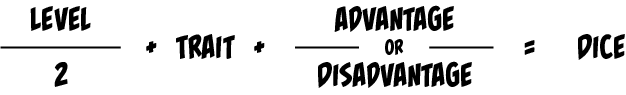
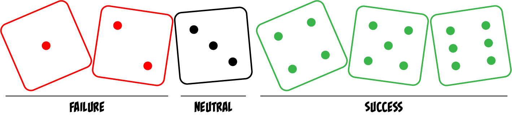
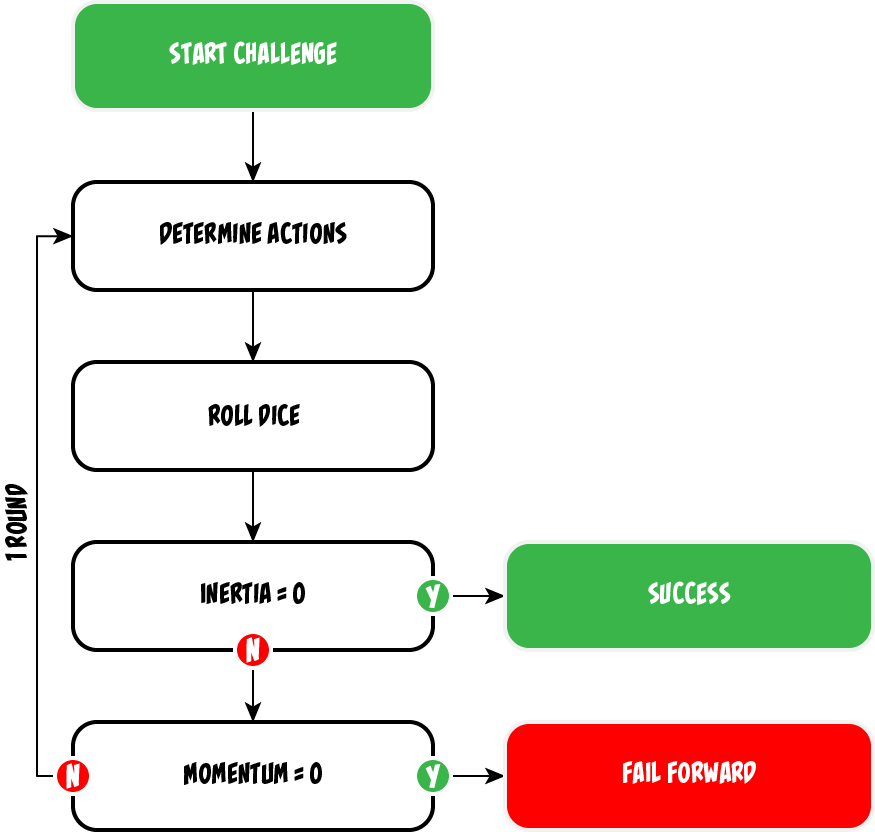

In Heroic Tales, your team tackles *challenges*, which represent the obstacles that you are trying to overcome. They are loosely grouped into four types:

- **Another character or group of characters** can be a direct challenge, such as during a blaster fight or when facing down a ship full of surly pirates. They can also be an indirect challenge, such as a scheming dragon plotting against you behind the scenes or a super-villain waging a public relations campaign.

- **The environment** is often a source of significant challenges. A solar storm that threatens to knock out your spaceship's communications, a magical trap on the floor of a dungeon, and a herd of rampaging centi-beasts are all environmental challenges.

- **You, yourself**, may be your greatest challenge. Whether addiction, depression, anxiety, or self-doubt, every hero has their demons, and they are often hard to conquer. Making a noble choice in the face of immediate gratification or resisting your natural instincts are other examples of internal conflicts.

- **Society** presents its own sets of challenges. Navigating social hierarchies takes education and practice. Greasing the wheels of a bureaucratic institution requires knowing the right people and processes. Cultural norms can limit a character’s ability to take direct action, requiring them to indirectly accomplish their goals through influence and coercion.

A series of challenges linked by a plot is known as an *adventure*. An adventure is like a short story or chapter of a novel. It is largely self-contained, but often ties into a longer, overarching narrative.

When a team embarks on a series of adventures using the same characters, it is known as a *campaign*. Over the course of a campaign, your characters will experience highs and lows; succeed heroically and fail dramatically; and grow and change individually and as a group.

Challenges may be extremely brief, or they may span days, months, or years of game time — they last exactly as long as whatever makes sense for the story. The difficulty of a challenge is known as its *inertia*.

## Inertia and momentum

The difficulty of a challenge is represented by its *inertia*, which can range from two to thirty-six. The exact value depends on how many team members are in your team and how difficult the GM determines the challenge to be. As your team advances in level, the number of *dice* you roll increases, making it easier for you to overcome any particular challenge.

```plaintext
Team Members	Easy	Normal	Hard
1				2		4		6
2				4		8		12
3				6		12		18
4				8		16		24
5				10		20		30
6				12		24		36
```

Your team's ability to make progress through a challenge is measured by your team’s *momentum.* Your team starts each challenge with two points of momentum per team member.

## Mechanics of play

For ease of play, challenges are divided into *rounds* that represent a unit of effort from your team. Like challenges themselves, rounds don’t represent a fixed unit of time, but rather adapt to the nature of the challenge. Each round begins with your team observing the scene, continues with you collaboratively determining your approach to overcoming the challenge, and ends when you, the players, simultaneously roll your dice. Your team’s actions may take as long as needed to serve the story.

Each player rolls a set of six-sided *dice* equal to half your team’s *level* (rounded up) plus the dice from your applicable *trait*, plus two dice if you gain *advantage* or minus two dice if you suffer from *disadvantage*.



The result of your die roll determines the outcome of your team’s choices: how much progress you made in overcoming the *inertia* of the challenge and how much *momentum* you spent along the way.

All fours, fives, and sixes count as *successes*; threes are *neutral*; and ones and twos count as *failures*. The result of the roll equals the total number of successes minus the total number of failures. You reduce the inertia of the challenge by the net number of successes that you generate.



If you end up with more failures than successes, though, you lose one point of *momentum*. Despite your best efforts, your character made things worse, not better. Your team begins each challenge with two points of momentum per team member.

As a rule of thumb, your team will, on average, exhaust their momentum after seven to nine rounds. Therefore, an easy challenge will last, on average, one to three rounds, a normal challenge four to six rounds, and a hard challenge, which strains the limits of the your team’s momentum, seven to nine.

## Advantage and disadvantage

If your character benefits from some sort of favorable condition, such as being fluent in Betelgeuseian when negotiating an interplanetary peace treaty or having pyroclastic blast powers when a giant paper mâché dragon awakens and threatens the town, then you gain *advantage* on your roll, adding two dice to your pool. The GM will decide if the situation is favorable enough to grant advantage.

If, instead, your character suffers from some sort of impairment (e.g. trapped in the web of a giant Antares moon spider), then you suffer *disadvantage* on your roll — you subtract two from your pool. You always gets to roll one die, though, even if suffering from disadvantage would reduce your pool to zero.

If your character is subject to multiple conditions that grant advantage or disadvantage, they do not combine. Advantage and disadvantage do, though, cancel each other out, so if your character has two conditions causing advantage but one condition causing disadvantage, you still get advantage on your roll.

## Overlapping challenges

Because challenges can span multiple time periods, they may occasionally overlap in part or in whole. An entire challenge can even be resolved between rolls for a second, longer challenge.

If the activities of the overlapping challenges distract from each other, such as attempting to decipher the Big Book of Evil Magic while fighting hordes of rampaging zombies, then you suffer *disadvantage* on your die rolls. The GM will adjudicate whether two overlapping challenges distract from each other.

However, it is also possible for the outcome of one challenge to reinforce another. If you use the corpses of hundreds of dead zombies to build a bulwark, you can decipher the Evil Tome of Evil Evilness in relative peace, gaining *advantage* on your roll.

## Making progress

As you reduce the *inertia* of the challenge, the scene will change. Perhaps the web of the giant Antares moon spider catches fire or maybe the horde of shambling zombies begin stumbling over each other.

If you reduce the challenge’s inertia to zero, then your team is successful. The results you were trying to achieve occur largely as you intended, and the GM narrates the results.

If your team’s momentum is reduced to zero, on the other hand, then you have failed to overcome the challenge within the provided constraints. You will still advance the plot, but you don’t manage to achieve your specific objective. The GM will determine what complications arise.

For example, if your team was trying to quietly steal the Helm of Inspired Awesomeness from the horde of a particularly paranoid dragon, you might stumble upon its kobold guards on the way out. Instead of making a clean escape, you get identified. Either way, you end up with a valuable magic item, but, in the latter case, you also make a new enemy.

If you reduce a challenge’s inertia to zero as part of the same roll that exhausts your team’s momentum, then you are still considered successful.


