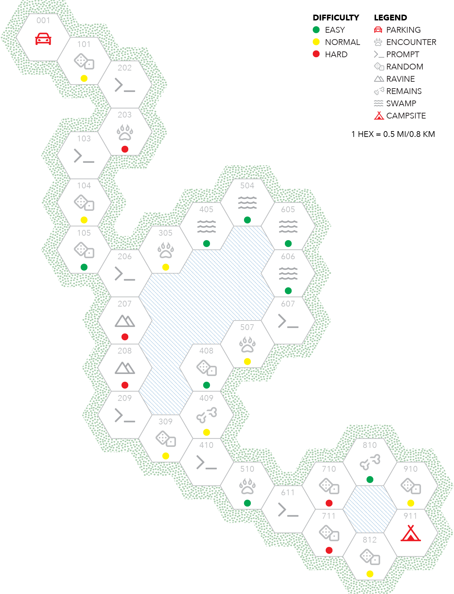

You begin your escape at your campsite which is located at the bottom right hand corner of the map. You’ll move from hex to hex as you make your way through the moonlit forest toward your car.

Some hexes will contain `challenges` and others `prompts`. When you enter a new hex, turn to its description for information about what you encounter, the difficulty of any challenge, and the next hex on your journey.

If you are tackling a challenge and lose all of your `momentum` before you reduce the challenge’s `inertia` to zero, decrease the count of your escape die by 1 and then move to the next hex. If you are victorious, on the other hand, increase its current count by 1 before moving on.

A few of the hexagons on the map are marked with an icon of dice. When you enter these hexes, roll 2d6 and consult the following table to determine what sort of challenge they contain.

# Random challenges

| **2d6** | **Challenge**              | **Trait** |
| ------- | -------------------------- | --------- |
| 2-3     | Shortcut                   | Mind      |
| 4       | Angry creatures            | Spirit    |
| 5       | Muddy and slippery terrain | Body      |
| 6       | Disbelief                  | Spirit    |
| 7       | Hiding spot                | Mind      |
| 8       | Uneven and steep terrain   | Body      |
| 9       | Panic                      | Spirit    |
| 10      | Dangerous obstacles        | Body      |
| 11-12   | Lost and found             | Mind      |

## Shortcut

You realize that you can find a more effective path back through the forest than the one you’re following.

>  Describe your environment and the shortcut you found. If you successfully complete this challenge, you gain advantage on your next roll of the dice.

## Angry creatures

Yellowjackets, snakes, skunks, and other forest creatures take a dim view of hikers who recklessly disturb their nests and burrows. Like you just did.

>  Describe what forest creature you just made angry. Your challenge is to extricate yourself from the situation without getting yourself hurt.

## Muddy and slippery terrain

The trail you followed to your campsite wound up and down slick, muddy hills that required care and time to climb and descend.

>  Describe the section of trail you now face. Your challenge is to traverse this section of the trail without sliding and tumbling and scraping yourself up.

## Disbelief

You can't help but be overcome by the absurdity of the situation. What are you doing? Why did you leave all of your camping gear in the middle of the woods?

>  Describe what you are thinking and feeling right now. Your challenge is to motivate yourself to keep moving.

## Hiding spot

You spot a place to hide and catch your breath.

>  What, if anything, do you see from your hiding spot? Your challenge is to remain undiscovered.

## Uneven and steep terrain

The hilly terrain is filled with tree roots and ankle-twisting rocks. It wouldn't take much to break a leg if you ran off the edge of a cliff as you navigate the forest in the dark.

>  Describe the terrain. What about it makes it dangerous? Your challenge is to traverse this section of the trail while avoiding a catastrophic fall.

## Panic

Your adrenaline kicks into overdrive and sheer, blind panic sets in.

>  Describe what you're feeling and thinking right now. Your challenge is to talk yourself back down.

## Dangerous obstacles

The forest is filled with falling branches, thorny thickets, loose rocks, and hidden hollows: all dangerous obstacles for someone running through the woods at any time — let alone in the middle of the night.

>  Describe what obstacles you encounter. Your challenge is to make it past them without wounding yourself or getting caught.

## Lost and found

You realize that you’ve lost your way. Nothing looks familiar under the light of the half-moon.

>  Describe what you to do get yourself moving in the right direction. Your challenge is to get yourself reoriented.
