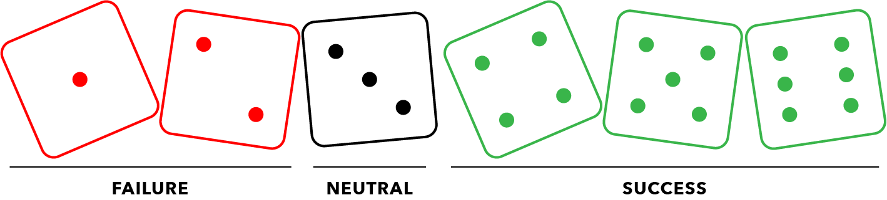
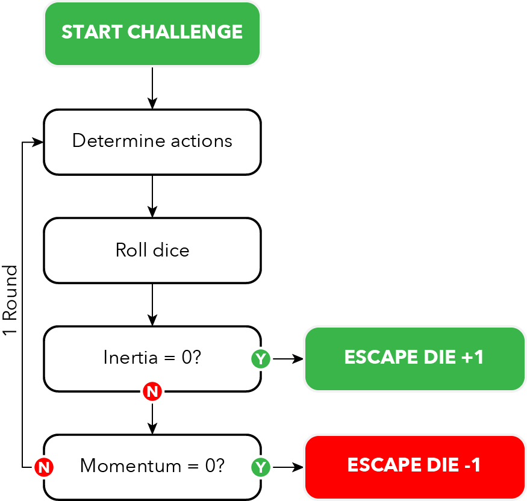

In Wendigo, you will tackle `challenges`, which represent the obstacles that stand between you and escape. During your journey through the dark and dangerous forest, you'll face steep cliffs, dangerous animals, treacherous terrain, and even your own fears. You'll use dice, your wits, and your character's abilities to overcome these challenges.

You’ll keep track of your character’s successes and failures on an `escape die`, a d6 that you’ll set aside and manually change the value of. The escape die starts with the 6 face up. Each time you fail a challenge you’ll decrease the value of the die by 1 and each time you succeed you'll increase it by 1 (to a maximum of 6). If the die ever reaches 1, your character's story comes to an abrupt and terrifying end. If you escape the woods, however, you'll receive one of five different endings.

Interlaced with the challenges are a series of prompts that ask you to reflect on your character’s life. This combination of challenges and prompts forms your character’s story.

# Challenges

As you navigate the dark and treacherous woods, you'll be presented with various challenges. The difficulty of a challenge is measured by its `inertia`. An easy challenge has an inertia of two, a normal challenge an inertia of four, and a hard challenge an inertia of six.

Your ability to overcome a challenge is measured by your `momentum`. You start each challenge with two points of momentum.

To determine your character's progress, roll a set of six-sided dice equal to one plus the dice from whichever of your character's three `traits` (body, mind, or spirit) is applicable. The description of each challenge will indicate which trait you should use. Some challenges will give you a choice of traits to use — in this case, choose the one with the highest rating. Add two dice if you gain `advantage` or subtract two dice if you suffer from `disadvantage`.

The result of your die roll determines the outcome of your choices: how much progress you made in overcoming the inertia of the challenge and how much momentum you spent along the way.

All fours, fives, and sixes count as `successes`; threes are `neutral`; ones and twos count as `failures`. The result of your roll equals the total number of successes minus the total number of failures. You reduce the inertia of the challenge by the net number of successes that you generate.

If you end up with more failures than successes, though, you lose one point of `momentum`. Despite your best efforts, you made things worse, not better.

Challenges are divided into `rounds` that represent a unit of effort from your character. Each round begins with your character observing the scene, continues with you determining your character's approach to overcoming the challenge, and ends when you roll the dice. Your character’s actions may take as long as needed to serve the story — neither a round nor a challenge has a fixed duration.

If, at the end of a round, you reduce the inertia of the challenge to zero or you lose your last point of momentum, then the challenge is over. Regardless of whether you succeeded or failed at the challenge, your character presses on unless the escape die has reached 1. Adjust the escape die according to the results and follow the prompts for the next challenge.

Otherwise, begin another round. If you reduce a challenge’s inertia to zero as part of the same roll that exhausts your character’s momentum, then you are considered successful.

## Escape die

Select one d6 to represent your character's ability to reach safety — this is the `escape die`. Begin your escape with the 6 facing up. Each time you successfully complete a challenge, increase the count on the escape die by 1 , to a maximum of 6. Each time you fail a challenge, decrease the escape die by 1.

If you reach safety before the escape die reaches 1, then turn to Endings and read the appropriate end to the story. If your escape die ever reaches 1, escape becomes impossible. Turn to Endings and read Ending 01.

## Advantage and disadvantage

Occasionally, your character will benefit from a condition favorable to them. The description of the challenge will alert you to this possibility. If you meet the conditions, then you gain advantage on your roll, adding two dice to your pool.

If, instead, your character suffers from some sort of impairment, then you suffer disadvantage on your roll — you subtract two from your pool. You always get to roll at least one die, even if suffering from disadvantage would reduce your pool to zero.

If your character is subject to multiple conditions that grant advantage or disadvantage, they do not combine. Advantage and disadvantage do cancel each other out, so if your character has two conditions causing advantage but one condition causing disadvantage, you still get advantage on your roll.

# Your character

Your character is a persona entirely of your creation. They might be an exact replica of you, or they can be someone of a different gender, sexuality, age, religion, or ethnicity. Those details are entirely up to you. In addition to your character’s physical description and personality they possess a few attributes that affect gameplay.

## Your traits

Your character has three traits that reflect general approaches to tackling a challenge: `body`, `mind`, and `spirit`.

- **Body** — you'll use your Body trait when you primarily rely on your physical skills and abilities to overcome a challenge.
- **Mind** — you'll use your Mind trait when you rely on pattern recognition, puzzle solving, or other analytical abilities.
- **Spirit** — use your Spirit trait when you primarily rely on your force of will to overcome an obstacle.

When you create your character, assign three dice to one trait, two dice to another, and one die to the last.

During each `round` of a `challenge`, you'll be prompted to use one of the three traits to reflect your character's actions. Some challenges will give you a choice of traits to use — in that case, use whichever trait is ranked the strongest.

## Camping gear

Your character has a backpack that contains useful camping gear. When you first create your character, choose one of the following items:

- Axe
- Compass
- Flashlight
- Lighter
- Swiss army knife
- Water bottle

During each challenge, when it makes narrative sense, you may pull out your chosen item and use it to gain a beneficial effect on one roll. Choose one of the following effects each time you use your gear:

- Grants you `advantage` on your next roll.
- Converts one failure to one success on your next roll.
- Permits you to re-roll any neutral results on your last roll.

On subsequent play-throughs, you can choose more than one item to stow in your pack, which grants you additional opportunities to influence dice rolls. Regardless of how many items you have available, you can only use one item per round.
